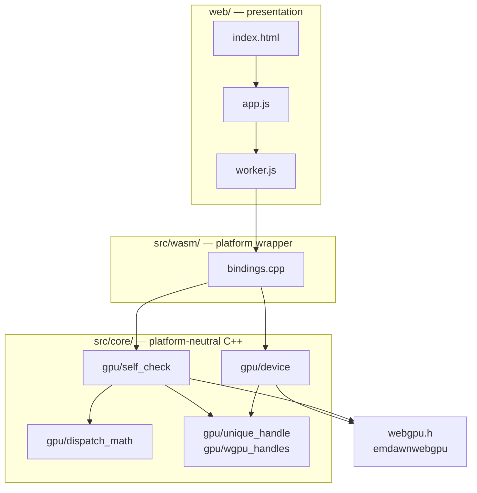
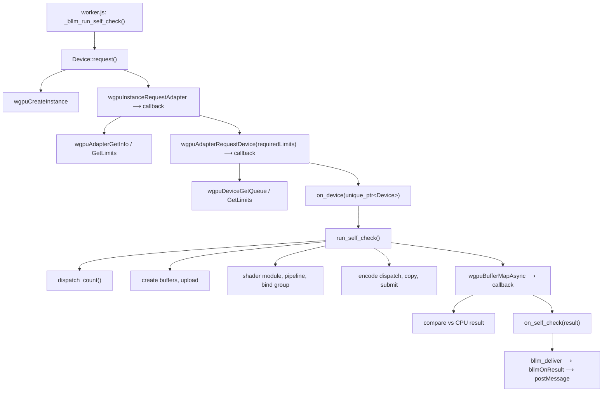

# Architecture

Module boundaries and the call tree, as built. Present tense only — planned
structure lives in [`README.md`](../README.md#repository-structure).

## Module boundaries

Arrows point inward only. Enforced by
[`tools/check_boundaries.sh`](../tools/check_boundaries.sh):

- No `emscripten.h`, `EM_JS`, `EM_ASM` or `EMSCRIPTEN_` under `src/core/`.
- No include from `core/` into `wasm/` or `web/`.
- `src/wasm/bindings.cpp` is the only Emscripten-aware translation unit.

## Call tree

`⟶ callback` marks the two asynchronous hops. The build has ASYNCIFY off, so
these are continuations rather than blocking waits, and every failure exits
through the same reporting path as success.
