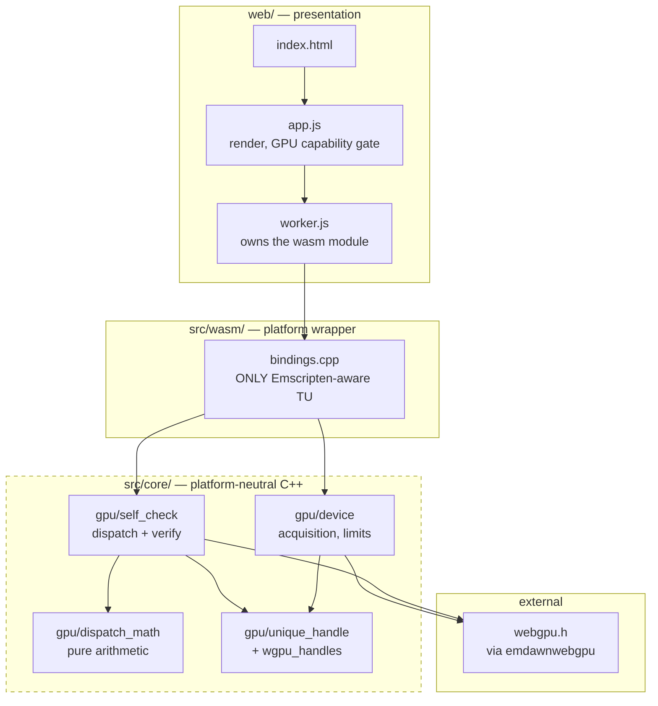
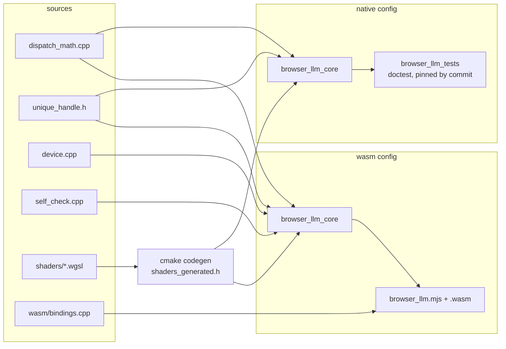
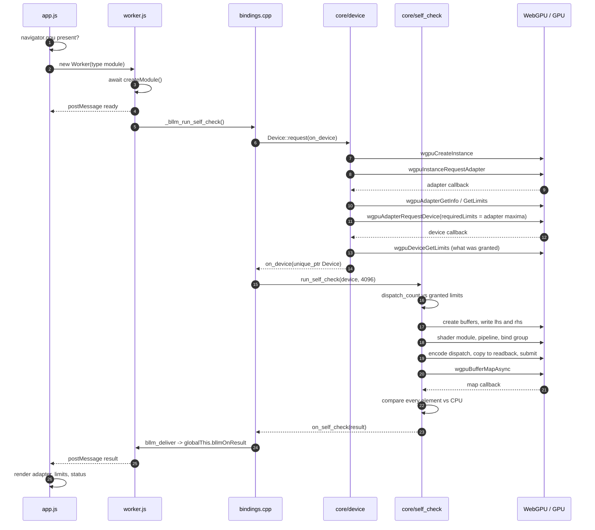
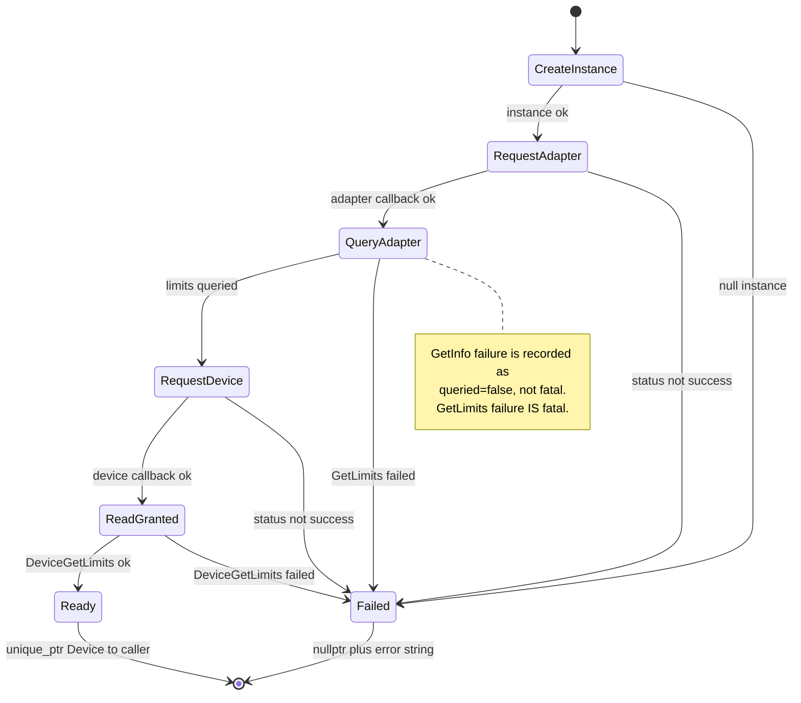
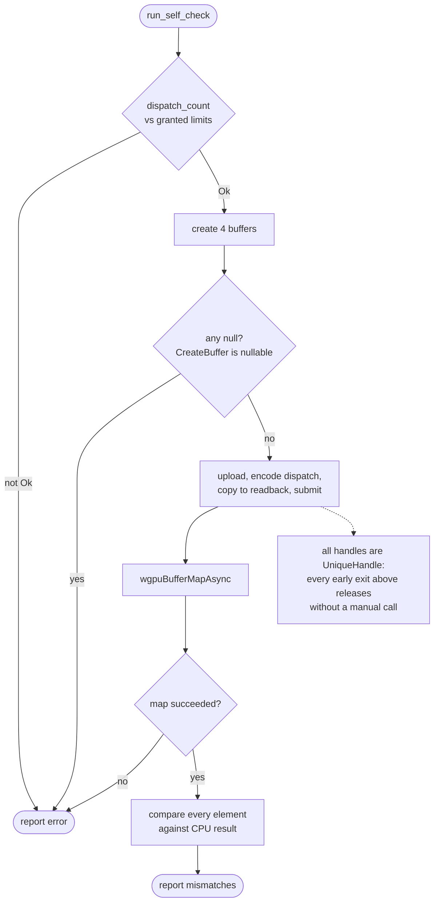

# Architecture

**As built on 2026-08-30.** Nothing here is planned or aspirational — every box
exists, every arrow is a call in the current tree. Planned structure lives in
[`README.md`](../README.md#repository-structure); this file is the present tense.

Scope today: the toolchain reaches the GPU and runs one compute shader. No
model, no inference.

---

## 1. Module boundaries

Dependency direction is one-way and mechanically enforced by
[`tools/check_boundaries.sh`](../tools/check_boundaries.sh).

**Enforced invariants** — each proven to fire by
[`tests/test_check_boundaries.sh`](../tests/test_check_boundaries.sh):

| Rule | Meaning |
|---|---|
| No `emscripten.h`, `EM_JS`, `EM_ASM`, `EMSCRIPTEN_` under `src/core/` | core compiles natively unchanged |
| No include from `core/` into `wasm/` or `web/` | arrows point inward only |
| Exactly `src/wasm/bindings.cpp` may be Emscripten-aware | exact path allowlist, not a count |

---

## 2. Build targets

The same core sources feed two targets. `device` and `self_check` compile only
under Emscripten today, because natively `webgpu.h` means linking Dawn — that is
deferred to the first model kernel (BLLM-003).

---

## 3. Runtime call sequence

One pass, from page load to rendered result. Two asynchronous hops sit inside
C++ — the build has ASYNCIFY off, so these are continuations, not blocking waits.

---

## 4. Device acquisition — control flow

Every exit is explicit. There is no path that returns a default-looking value
on failure.

---

## 5. Self-check — control flow

---

## 6. Ownership

| Resource | Owner | Released by |
|---|---|---|
| WebGPU handles | `UniqueHandle<H, ReleaseFn>` | destructor, exactly once |
| `Device` | caller, via `std::unique_ptr` | caller |
| `PendingDeviceRequest` | itself, across the async hop | `delete this` on either exit |
| `ReadbackContext` | itself, across the map hop | `delete this` in `finish()` |
| module run state | function-local statics in `bindings.cpp` | process teardown |

The last three rows are **open findings**, tracked as BLLM-005: manual ownership
sitting outside the `UniqueHandle` system, and singleton state that
construct-on-first-use does not eliminate.

---

## 7. What has no automated test

Stated because the gaps matter more than the coverage.

| Covered natively | Not covered |
|---|---|
| `dispatch_math` arithmetic and bounds | device acquisition |
| `UniqueHandle` ownership semantics | granted-limit behavior |
| shader embedding, byte-identical | adapter metadata failure |
| boundary rules fire | device loss |
| review preflight refuses | GPU execution, browser page contract |

The right column needs native Dawn (BLLM-003) or a browser test. Until then the
GPU path is verified only by the readback assertion on the page itself.
