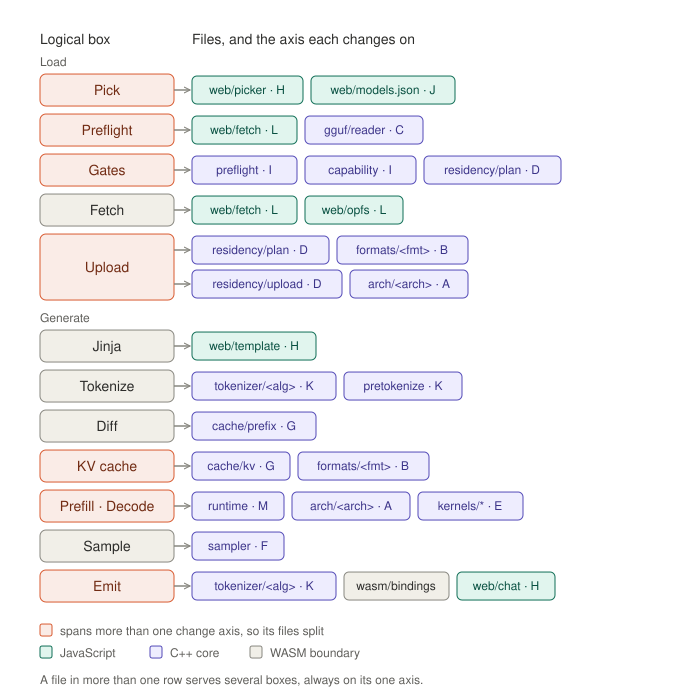

# File mapping

How the boxes in [`logical-overview.md`](logical-overview.md) become files,
applying the rule in [`change-axes.md`](change-axes.md): one translation unit,
one reason to change.

It names the modules, the axis each changes on, and the contracts between
them.

## Layers

- **JavaScript, `web/`** — the interface, the curated model list, template
  rendering, network and storage.
- **The boundary** — `web/worker.js` on the JavaScript side and
  `src/wasm/bindings.cpp` on the C++ side. Nothing else crosses.
- **C++ core, `src/core/`** — everything from the file header onward. Never
  aware it is in a browser; builds and tests natively.

## Modules

| Module | Axis | Owns |
|---|---|---|
| `web/picker.js` | H | choosing a model; showing an unmeasured model as unmeasured |
| `web/models.json` | J | the curated list: one measured configuration per model |
| `web/template.js` | H | rendering the model's chat template |
| `web/chat.js` | H | conversation state and streamed rendering |
| `web/fetch.js` | L | range and streaming fetch, with progress |
| `web/opfs.js` | L | the model file cache |
| `web/worker.js` | boundary | owns the WASM module; the JavaScript side of every crossing |
| `src/wasm/bindings.cpp` | boundary | the only Emscripten-aware C++; the crossing budget |
| `src/core/gguf/` | C | reader, the tensor index it produces, and a size for every format GGUF defines |
| `src/core/capability/` | I | what the code implements |
| `src/core/preflight/` | I | the four gates |
| `src/core/model/` | contract | the model description: every number, with no reference to architecture |
| `src/core/policy/` | contract | a model's measured configuration, and the defaults for an unmeasured one |
| `src/core/arch/architecture.h` | contract | what every architecture supplies |
| `src/core/arch/<arch>/` | A | reading its numbers into the model description, its graph, its load transforms |
| `src/core/formats/format.h` | contract | what every weight format supplies |
| `src/core/formats/<format>/` | B | block layout, pack and unpack in WGSL, the upload transform |
| `src/core/residency/plan` | D | the planner, pure; candidate duplicates |
| `src/core/residency/weight_view` | contract | what a kernel is given for a weight |
| `src/core/residency/upload` | D | writing planned buffers; confirming duplicates byte for byte |
| `src/core/gpu/` | D | device, handles, dispatch geometry |
| `src/core/kernels/<kernel>/` | E | one WGSL file and its launcher per regime |
| `src/core/kernels/interface` | contract | binding and parameter convention shared by every kernel |
| `src/core/cache/prefix` | G | longest common prefix |
| `src/core/cache/kv` | G | per-layer buffers, capacity, window, storage precision |
| `src/core/tokenizer/tokenizer.h` | contract | encoding and streaming decode, for every algorithm |
| `src/core/tokenizer/<algorithm>/` | K | encode and decode |
| `src/core/tokenizer/pretokenize` | K | split patterns keyed by name, and the Unicode category tables they need |
| `src/core/sampler/` | F | sampling methods; settings and seed are passed in |
| `src/core/runtime/` | M | the turn loop: diff, prefill, decode, sample |

Rows marked *contract* carry no axis. A contract header changes only
when the contract itself changes, which is cross-cutting by definition: every
consumer is affected, and it is reviewed as such rather than hidden inside a
module.

CPU reference implementations of formats and tokenizers live under `tests/`,
not in `src/core/`. They are the oracle the GPU and C++ implementations are
checked against. A CPU dequantizer in core would be an invitation to call it,
and production never materialises a dequantized weight.

## Logical boxes to files

| Box | Files, with axis | Split across axes |
|---|---|---|
| **Pick** | `web/picker.js` H · `web/models.json` J | yes |
| **Preflight** | `web/fetch.js` L · `core/gguf` C | yes |
| **Gates** | `core/preflight` I · `core/capability` I · `core/residency/plan` D | yes |
| **Fetch** | `web/fetch.js` L · `web/opfs.js` L | no — split within L, since network and storage change independently |
| **Upload** | `core/residency/plan` D · `core/formats/<format>` B · `core/residency/upload` D · `core/arch/<arch>` A | yes |
| **Jinja** | `web/template.js` H | no |
| **Tokenize** | `core/tokenizer/<algorithm>` K · `core/tokenizer/pretokenize` K | no — split within K |
| **Diff** | `core/cache/prefix` G | no |
| **KV cache** | `core/cache/kv` G · `core/formats/<format>` B | yes |
| **Prefill · Decode** | `core/runtime` M · `core/arch/<arch>` A · `core/kernels/*` E | yes |
| **Sample** | `core/sampler` F | no |
| **Emit** | `core/tokenizer/<algorithm>` K · the boundary · `web/chat.js` H | yes |

## Files that serve several boxes

A file used by two boxes is where its interface matters most. Each still
changes on exactly one axis.

- **`residency/plan`** serves Gates and Upload. Gate 4 runs the planner before
  any weight is fetched, so it must be a pure function of the tensor index, the
  model description, the granted limits and the policy.
- **`formats/<format>`** serves Upload and the KV cache. Packing and unpacking
  a format is the same knowledge whether the data is a weight or a cached key.
- **`arch/<arch>`** serves Upload, through its load transforms, and the forward
  pass, through its graph.
- **`tokenizer/<algorithm>`** serves Tokenize and Emit: encode on the way in,
  streaming decode on the way out.
- **`web/fetch.js`** serves Preflight, which reads the header prefix, and Fetch,
  which downloads the whole file.

## Pre-tokenization is C++

The boundary crossing is not a meaningful cost. Encoding happens once per turn, and splitting in JavaScript adds only an offset
array about the size of the text — well under a millisecond for a full
context, against a pipeline measured in hundreds of milliseconds. What places it
in C++:

- *Determinism.* JavaScript's `\p{…}` classes follow the browser's Unicode
  tables, which change with browser releases, so newly assigned characters
  could split differently between browser versions. Tables compiled into C++
  pin the same Unicode version as the reference tokenizer.
- *Testability.* Tokenization is checked byte-exactly against fixtures in the
  native test suite. Splitting in JavaScript would divide that oracle across
  two harnesses.

The cost is module size: the category tables add to the WASM binary, which
WASM.8 treats as startup latency.

## The reader does not decide support

For every
tensor it records name, format, shape and byte range, and validates the range
against the file using a size table that covers **every** format GGUF defines,
including formats the harness cannot run. A format it cannot run is recorded,
not rejected: the verdict belongs to the gates, which consult the capability
table and name the tensor they reject. The reader knows nothing of which
formats are implemented and depends on nothing in `formats/`.

## Contracts

Four rules hold for every contract:

- **Failures are named and returned.** Each module has a closed list of the
  ways it fails, returned as values. Nothing throws.
- **Nothing blocks.** Work that waits on the GPU or the network completes
  through a callback.
- **Memory is allocated at load.** The per-token path allocates nothing.
- **Few modules hold GPU objects.** `gpu/`, upload and kernel launch do. The
  KV cache and weight views name buffers by their index in the residency plan.
  Everything else builds and is tested without a device.

1. **Byte source** — `core/gguf`. A file size the reader can trust, and bounded
   reads against it. The reader never waits for bytes: given too little of the
   file, it reports how far into the file it needs to read, and the caller
   fetches that much and parses again.
2. **Tensor index** — `core/gguf`. Immutable once parsed. Every tensor, with
   name, format, shape and byte range, including formats the harness cannot
   run. Scalar and string metadata is decoded during the parse and read through
   typed accessors that distinguish a missing key from a key of the wrong type.
   Arrays, such as a vocabulary, are located rather than decoded; the consumer
   decodes them from the byte source.
3. **Capability** — `core/capability`. One table from each identifier a file
   carries — architecture, weight format, tokenization algorithm, pre-tokenizer
   — to the implementation that runs it. Supported means present in the table;
   there is no second list.
4. **Model description** — `core/model`. Every number the planner, cache and
   graph need, per layer where the model varies per layer, and each layer's
   tensors by role. The graph and the kernels address weights by role and
   identifier; no tensor name reaches them.
5. **Residency plan** — `core/residency/plan`. A pure function: tensor index,
   model description, granted limits and policy in; buffers, and each tensor's
   place in them, out. It plans against the limits the device granted, never
   the adapter's advertised maxima, and its packing works at WebGPU's default
   limits. A tensor larger than one binding is split by rows, and every offset
   is aligned to WebGPU's storage-offset alignment. The fit check counts every
   tensor. Tensors with the same format, shape and length are marked as
   candidate duplicates, and upload shares their storage only after confirming
   the bytes match.
6. **Weight view** — `core/residency/weight_view`. What a kernel is given for a
   weight: buffer, offset, length, format and shape as one value, or a list of
   them for a tensor split across bindings. It names a buffer by its index in
   the plan, so it holds no GPU object.
7. **Kernel launch** — `core/kernels/interface`. Every kernel binds the same
   way: the step's parameters, shared by every launch; the launch's constants,
   written at load; then weights, then activations. Bind groups are built at
   load; a token costs one uniform write and its dispatches. The runtime picks
   the regime from the number of tokens in the step.
8. **KV cache** — `core/cache/kv`. Full length for every layer, including
   sliding-window layers: the window is applied by attention, not by storage,
   so truncation resets a counter. Capacity and window come from the model
   description, storage precision from policy, packing from the format. Its
   storage is planned by the residency plan and created by upload.
9. **Tokenizer** — `core/tokenizer`. Encoding turns rendered text into
   identifiers; special tokens written in the text encode as their single
   identifiers. Decoding is a stream: bytes that end mid-character are held
   until the next token completes them.
10. **Sampler** — `core/sampler`. The GPU reduces the logits to the top-k
    candidates, and the sampler chooses among them. Randomness is a pure
    function of the seed and the token's position, so a seed reproduces a run.
11. **The boundary** — `web/worker.js` and `src/wasm/bindings.cpp`. Preflight a
    prefix, load a chunk, generate from a prompt and policy, cancel. One
    crossing per streamed token (WASM.2).
12. **Policy** — `core/policy`. A model's measured configuration from
    `web/models.json`: cache precision, sampling settings per mode, and the
    template variables it exposes. Cache precision crosses at load. Sampling
    settings depend on the turn's mode, so they cross with each generate,
    together with the seed. Template variables never leave JavaScript. An
    unmeasured model receives the defaults defined in `core/policy`. The context
    offered is not policy; it is derived from the file, the device budget and
    the cache precision.
