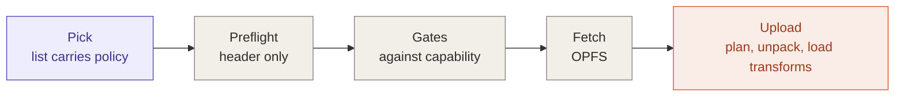
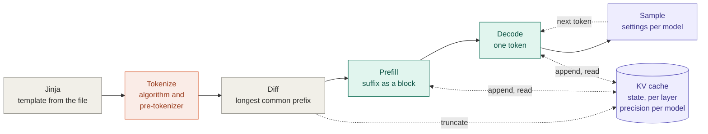
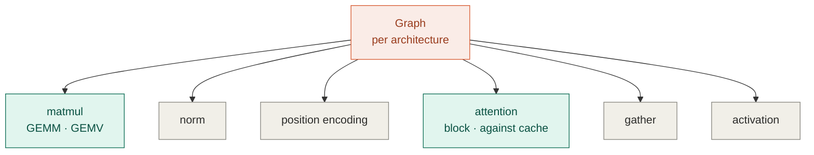

# Logical overview

What the harness does, and the principles that decide how it handles the ways
models differ.

This is the **logical** view: phases, responsibilities, and principles. It
names no files, no types, and no interfaces. The rules that turn these boxes
into files are in [`change-axes.md`](change-axes.md); the mapping itself is a
separate document, written when the mapping is real. A previous architecture
document drifted because it described a design that was never built; this one
is kept to claims that can be checked against a model file.

The principles are general. Three real model files were read to test them, and
those appear only as evidence at the end — they are examples, not the design.

## The flow

Shading is the same in all three diagrams: **coral** is selected by an
identifier in the file, **purple** is per-model policy, **teal** is a regime.
**Gray** is written once and serves every model.



**Load** runs once per model. Everything before `Fetch` reads only the header,
so an incompatible model is rejected before its weights are downloaded.



**Generate** runs per turn. The whole conversation is re-rendered and
re-tokenized every turn; the diff is what makes that cheap. The KV cache is
drawn as state rather than as a step, because that is what it is — see below.



**Inside Prefill and Decode.** The graph is the only thing that knows the
architecture. It chooses which shared kernels run, in what order, with what
parameters. The kernels do not know which model they serve.

## Principles

These decide how any difference between models is handled. Each was tested
against real files, but none is specific to the files tested.

1. **Kernels never know the family.** A kernel is parameterized by shape,
   stride, weight format and regime. Knowledge of a family lives in exactly two
   places: the graph, which decides which kernels run in what order with what
   parameters, and load transforms. A kernel that branches on family must be
   re-verified for every family added.

2. **Each identifier in the file selects exactly one implementation.**
   `general.architecture` selects a graph and its load transforms. A tensor's
   type selects its pack and unpack. `tokenizer.ggml.model` selects a
   tokenization algorithm, and `tokenizer.ggml.pre`, where present, selects the
   pre-tokenizer that splits text before the algorithm runs. These are
   independent: families share algorithms without sharing pre-tokenizers,
   formats cross families, and any combination can appear in a file. The
   mapping is many-to-one — several identifier values may select the same
   implementation — but never one-to-many.

3. **The file supplies every number.** Layer count, head counts, head
   dimension, attention window, RoPE θ, epsilon and context length are read per
   file. None is a constant keyed on the architecture. Two conversions of the
   same model can disagree, and have.

4. **Normalize at load before branching in a kernel.** When a family's
   convention is a reparametrization of its weights — a norm offset, a
   permutation, a folded scale — apply it once at upload so the kernel stays
   uniform. Branch only for operations that differ in kind. The exception is a
   weight used in two places, such as an embedding tied to the output head,
   where a fold that is correct for one use is wrong for the other.

5. **Detect structure; never assume it.** Whether a tensor exists — a separate
   output head, a bias, an optional norm — is read from the tensor index at
   load. No architecture is assumed to have or to lack one.

6. **What differs in kind is a shared kernel.** A new activation, norm type or
   position encoding is a new kernel that any graph can dispatch. It is not a
   branch inside an existing kernel, and it does not belong to the family that
   first needed it.

7. **Support is declared, and everything else is rejected by name.** One
   capability table lists the graphs, weight formats, tokenization algorithms
   and pre-tokenizers implemented. Preflight checks a model against it before
   download, and a miss names the identifier and its value — *"tensor
   blk.0.ffn_down.weight is Q4_1, which is not implemented"* — rather than
   failing somewhere during the load. A server engine can fall back to running
   a model's reference implementation, slowly; a browser has no reference
   implementation to run, so rejecting by name is the only honest outcome.

8. **Policy is measured per model, and an unmeasured model is labelled.** How
   to sample, what precision the cache uses, and which controls the interface
   offers are not in the file. They are recorded per model in the curated
   list. A model without an entry runs on defaults and is shown as unmeasured.

9. **Regime is orthogonal to model.** Prefill and decode are shapes of a call,
   not properties of a model. A kernel whose best form depends on that shape
   has one implementation per regime, and never one per family.

## The design space

What varies across decoder-only transformers, and which principle handles it.

| What varies | Examples | Handled as |
|---|---|---|
| Norm type | RMSNorm, LayerNorm | shared kernel (6) |
| Norm placement | before, after, or both | graph |
| Norm weight convention | `w`, `1 + w` | load transform (4) |
| Heads, head dimension, θ, ε, scale | numbers | file parameter (3) |
| Attention sharing | multi-head, grouped, multi-query | file parameter |
| Attention window | global, sliding, interleaved per layer | per-layer parameter |
| QK-norm, QKV biases | present or absent | detected (5) |
| Position encoding | RoPE and its pairing and scaling variants, ALiBi, none | shared kernel and parameters |
| Logit softcapping | present or absent | shared kernel and parameter |
| MLP | gated or plain, and which activation | graph and shared kernel |
| Mixture of experts | a router and experts | graph and new shared kernels |
| Embedding scale | none, √d | graph, or load transform if the embedding is not tied |
| Output head | tied to the embedding, or separate | detected |
| Tokenization algorithm | BPE, SentencePiece, WordPiece | its own implementation (2) |
| Pre-tokenizer | a split pattern, named per lineage | selected by name; the file names it but does not carry it (2) |
| Weight format | per tensor | pack and unpack (2) |

Two consequences are worth stating outright:

- **Weight format reaches only what reads weights.** That is the projections,
  the embedding gather and the output head. Attention proper — scores, softmax
  and the weighted sum — reads activations and the cache, never weights.
- **Which path is hot is decided by the file.** Bandwidth flows through the
  unpack of whatever format the largest tensors are stored in. That is a
  property of a particular file, not of its family, and it is why optimizing
  "the matmul" means every unpack path shipped.

## Two regimes

The diff-and-prefill design means the forward pass runs in two shapes, and they
want different kernels.

| | Decode | Prefill |
|---|---|---|
| Tokens per pass | one | the diffed suffix — up to thousands |
| Projections | matrix × vector | matrix × matrix |
| Attention | one query per head against the cache | a causal block over the suffix |
| Bound by | weight bandwidth | arithmetic |
| Runs when | every generated token | the first turn, a long system prompt, and every re-prefill after the template rewrites history or context overflows |

So the matmul is two kernels, and so is attention. Neither forks on family.

## The KV cache is state keyed on tokens

The cache is keyed on **the token sequence**, never on the message list, and it
is touched at two levels:

- **once per turn**, the diff truncates it to the longest common prefix — a
  length counter, with no data movement;
- **in every layer, on every token**, both regimes append new K and V and read
  the cache back for attention.

Drawing it as a step in the turn pipeline would hide that most of its traffic
is inside the forward pass.

Keying on tokens is not a performance convenience. It is the only correct
option, because **a chat template may rewrite history retroactively**, and a
cache keyed on message boundaries then reuses a prefix the template has already
changed. The corruption is invisible; the output just gets worse. Qwen3's
template is a concrete example: it computes `last_query_index` by scanning
backwards for the most recent user turn, then

```jinja

    ... '<think>\n' + reasoning_content + '\n</think>\n\n' + content

    ... content          {# think block dropped #}

```

so adding a user turn strips the reasoning block from an assistant message that
carried it the turn before.

Two consequences:

- **The JavaScript side is stateless with respect to the cache.** It renders
  everything and sends a string. It does not compute deltas, track what is
  cached, or know that token identifiers exist. One place can get this wrong,
  and it is the place holding the tokens.
- **Context overflow uses the same mechanism.** Drop the oldest messages,
  re-render, and the diff finds a short common prefix on its own. It is slower
  for that turn, correct by construction, and visible to the user.

The cache's mechanism is the same for every model. Its storage precision is
not — that is policy, below.

## Per-model policy

Some choices differ per model and are carried by neither the code nor the
file. We decide them — from the model card, or by measurement — and record
them per model (principle 8).

**Cache precision.** Storage is 16-bit or narrower; arithmetic is always f32,
because nothing here requires `shader-f16`, so the only error introduced is
storage rounding. Which format is right depends on how hard the cache binds
context length for that model. Where KV bytes per token are large against the
memory budget, narrower storage buys context; where they are small, there is
little to gain. f16 and bf16 are the same size with opposite trade-offs — f16
has three more mantissa bits, bf16 has f32's range — and a model trained in
bf16 has only ever produced values bf16 can hold. The choice sits on the
bounded-divergence side of the correctness gate, so it is made by measuring
logits against an f32-cache reference over real conversations, not by
argument. Until measured, f16 is a starting point, not a decision.

**Sampling.** Model cards specify sampling settings, and they are not
interchangeable between models or even between modes of one model. Qwen3's
card, for example, warns *"DO NOT use greedy decoding, as it can lead to
performance degradation and endless repetitions."* So the product sampler is
stochastic, and its randomness is an injected seed rather than ambient state: a
fixed seed reproduces a run exactly. Comparing top-1 against a reference
remains a valid *test*; it is not the product sampler.

**Interface affordances.** Some models expose modes through template
variables, such as a thinking mode, and some expose none. A control that exists
for one model and not another is policy, not code.

**Context offered** is derived, not chosen: the smaller of the file's declared
context and the device budget divided by KV bytes per token at the chosen
precision.

**Where policy lives.** The curated model list is a list of measured
configurations — file, hash, cache precision, sampling per mode, affordances —
not a list of URLs. It changes when a model is measured. The capability table
changes when code is written. Different reasons, so they are two things. A
model loaded from a pasted URL gets defaults and is shown as unmeasured;
presenting an untested model as tuned would claim something nobody checked.

## Why preflight exists

A model is rejected **before** its weights are downloaded. The metadata block
and the tensor index sit at the front of the file and are a small fraction of
it, and they answer every compatibility question — including the one only the
tensor index can answer: which weight formats are actually present.

That question cannot be answered from the filename. A file named for one
format routinely contains others; in the evidence below, three of four files
named `Q4_0` also carry other formats.

The four gates are principle 7 applied: architecture implemented, every tensor
format implemented, tokenization algorithm and pre-tokenizer implemented, and
the residency plan fits the
**granted** device limits. The planner is a pure function of the tensor index
and the limits, which is what lets it run before a single weight byte is
fetched.

The gates and the unpack dispatch consult **one** capability table. Two lists
will diverge, and a picker that reports "compatible" for a model that then
fails to load is worse than no picker.

## Platform constraints

Four properties of the target shape everything above. They are constraints, not
preferences, and each one closes off an option that would otherwise look
reasonable.

**The GPU is reached through `webgpu.h`, not JavaScript.** In the browser,
`--use-port=emdawnwebgpu` implements that C API on top of the browser's WebGPU.
Natively, the same API is implemented by Dawn — the same engine Chrome uses,
with the same Tint shader compiler. So identical kernel code can run under a
native test binary and in a browser, and native tests exercise the real stack
rather than a mock. Driving WebGPU from JavaScript would put the forward pass
on the wrong side of the WASM boundary.

**No threads.** GitHub Pages cannot set `Cross-Origin-Opener-Policy` or
`Cross-Origin-Embedder-Policy`, so `SharedArrayBuffer` is unavailable and
pthreads cannot be used. The same absence of cross-origin isolation clamps
`performance.now()` to 100 µs, which constrains how anything here can be
measured. Responsiveness comes from a plain Web Worker, which needs no shared
memory — acceptable because the GPU does the compute while WASM parses,
tokenizes, dispatches and samples.

**Weights are not in this repository and cannot be.** GitHub caps files at
100 MB and Pages does not serve Git LFS, against a several-hundred-megabyte
quantized model. They are fetched on first run, verified, and cached in OPFS.
The code is self-contained; the weights are not.

**No inference dependencies.** No llama.cpp, no ggml, no ONNX Runtime, no npm,
no bundler. Vendoring an inference stack would defeat the premise. Third-party
code is for things that are not the demonstration — which is why the chat
template, a full Jinja2 dialect, is rendered by a library on the JavaScript
side rather than reimplemented in C++.

## Evidence

Three architectures were read to test the principles above, and the source of
two production engines was read to check that their boundaries match. All of it
is evidence and example; the design does not depend on it.

GGUF headers were read by range request on 2026-09-23 and 2026-09-24. RoPE
pairing comes from llama.cpp's `llama_model_rope_type`. Qwen3's sampling
settings come from its model card, read 2026-09-24.

| | Qwen3-0.6B | Gemma 3 1B | Llama 3.2 1B |
|---|---|---|---|
| Source | `ggml-org/Qwen3-0.6B-GGUF` | `google/…-qat-q4_0-gguf`; `unsloth/…` | `unsloth/Llama-3.2-1B-Instruct-GGUF` |
| `general.architecture` | `qwen3` | `gemma3` | `llama` |
| `tokenizer.ggml.model` | `gpt2` | `llama` | `gpt2` |
| `tokenizer.ggml.pre` | `qwen2` | absent | `llama-bpe` |
| Formats in the `Q4_0` file | Q4_0, F32 | Q4_0, F32, F16; or Q4_0, F32, Q8_0, Q4_1 | Q4_0, F32, Q5_K, Q4_1 |
| Tensors | 311 | 340 | 147 |
| Header ends at | 5.95 MB of 429.0 MB | 6.53 MB of 1,004 MB | 7.83 MB of 773.0 MB |
| Layers | 28 | 26 | 16 |
| KV heads × head dimension | 8 × 128 | 1 × 256 | 8 × 64 |
| Attention | all global | 5:1 local and global; window 1024 or 512 | all global |
| RoPE pairing | NEOX | NEOX | NORM |
| Separate `output.weight` | yes, byte-identical to the embedding | no | no |
| KV per token at f16 | 112 KiB | 26 KiB | 32 KiB |
| Full-context KV | 40,960 tokens → 4.4 GiB | 32,768 tokens → ~190 MB | 131,072 tokens → 4.0 GiB |

What each finding demonstrates:

- **Identifiers are independent (principle 2).** Qwen3 and Llama 3 are
  different architectures that share a tokenization algorithm, byte-level BPE —
  but not a tokenizer. Their pre-tokenizers differ, `qwen2` against
  `llama-bpe`, so the same text is split differently before a single merge is
  applied, and using one for the other produces wrong token IDs from a correct
  merge table. Gemma 3 uses a different algorithm entirely. The names cross
  over too: the tokenizer identifier `llama` means SentencePiece, and the
  `llama` architecture does not use it.
- **The file supplies every number (principle 3).** Google's Gemma 3 build
  declares `sliding_window = 1024`; a community build of the same weights
  declares `512`. A constant keyed on `gemma3` would be wrong for one of them.
- **Detect structure (principle 5).** Qwen3's file stores its tied output head
  twice, byte-identical — 87.5 MB of the download and of device memory that a
  planner detecting duplicates need not spend. The Gemma 3 and Llama 3.2 files
  store it once, so the head reads the embedding. Same concept, two layouts,
  and neither follows from the architecture.
- **Which path is hot is decided by the file.** In Google's Gemma 3 build the
  embedding is F16 at 604 MB. The head reads it on every decoded token, against
  roughly 400 MB for everything else, so about 60% of decode weight bandwidth
  is an F16 matmul in a file named `q4_0`.
- **Filenames are not evidence of format (principle 7).** Three of the four
  files named `Q4_0` carry other formats. Google's build is also 4.7× the
  default storage-binding limit in a single tensor, so it fails on device fit
  as well as on format.
- **Cache precision is per model (principle 8).** Full-context KV spans more
  than 20× across three small models. Per-token size alone does not predict
  it: Llama 3.2's is less than a third of Qwen3's, yet its declared 131k
  context brings it to 4.0 GiB. What makes Gemma 3 cheap is the sliding window.
  For two of the three the cache binds context length; for the third it barely
  registers.
- **Decode dispatch counts follow from the tensor index.** Qwen3's file holds
  198 Q4_0 tensors and 113 F32 tensors, which decompose exactly as seven
  projections × 28 layers plus the embedding and the output head, and four
  norms × 28 layers plus the final norm. In decode that is 197 matmuls and one
  gather per token, with 113 norms, 56 position encodings, and 28 each of
  attention and activation.

**Production engines draw the same boundaries.** From source, read 2026-09-24.

- vLLM's model registry, `vllm/model_executor/models/registry.py`, maps the
  `architectures` string in a model's `config.json` to an implementation. The
  mapping is many-to-one: `InternLM3ForCausalLM` and several others resolve to
  the `llama` implementation. An architecture not in the registry needs a new
  implementation, an out-of-tree registration, or vLLM's fallback,
  `TransformersForCausalLM`, which runs Hugging Face's reference modeling code.
- llama.cpp names 153 architectures in `llama-arch.cpp` and constructs their
  graphs in code keyed by architecture. It separately recognises 57
  pre-tokenizer types in `llama-vocab.cpp`, selected by `tokenizer.ggml.pre`,
  and refuses to load a model whose pre-tokenizer it does not know — even on a
  supported architecture.

In both, new weights for a known architecture need no code, and a new
architecture, weight format or tokenizer does — the boundaries of principles 2
and 3. The one difference is the fallback, which is why principle 7 rejects by
name instead.

## What this document does not contain

No file layout, no type names, no interfaces, no acceptance criteria. Those
belong to the mapping that comes next, and writing them here before the code
exists is how the previous architecture document became fiction.
