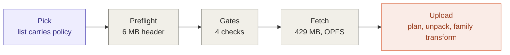
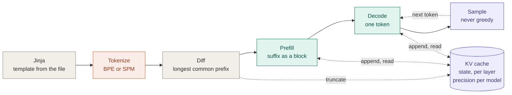
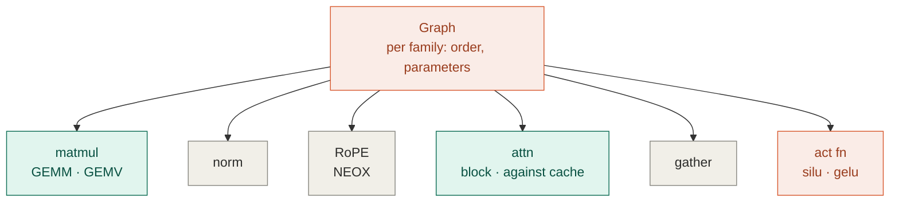

# Logical overview

What the harness does, and every point where it varies by model.

This is the **logical** view: phases, responsibilities, and branch points. It
names no files, no types, and no interfaces. The rules that turn these boxes
into files are in [`change-axes.md`](change-axes.md); the mapping itself is a
separate document, written when the mapping is real. A previous architecture
document drifted because it described a design that was never built; this one
is kept to claims that can be checked against a model file.

Every number here was read from real GGUF headers or model cards, not
estimated. Provenance is at the bottom.

## The flow

Shading is the same in all three diagrams: **coral** is a code fork, **purple**
is per-model policy, **teal** is a regime. **Gray** is written once and serves
every model.



**Load** runs once per model. Everything before `Fetch` is cheap enough to
reject an incompatible model before its bytes are spent.



**Generate** runs per turn. The whole conversation is re-rendered and
re-tokenized every turn; the diff is what makes that cheap. The KV cache is
drawn as state rather than as a step, because that is what it is — see below.



**Inside Prefill and Decode.** A per-family graph decides order and parameters;
the kernels it dispatches are shared. Two of them have a form per regime.

In decode, per token, Qwen3-0.6B dispatches the matmul 197 times, the norm 113,
RoPE 56, attention and the activation 28 each, and the gather once. These are
not estimates. The file carries 198 Q4_0 tensors and 113 F32 tensors, which
decompose exactly as 7 projections × 28 layers plus the embedding and the
output head, and 4 norms × 28 layers plus the final norm. The quantization
census *is* the decode dispatch count — 197 tensors consumed by the matmul, one
by the gather.

## Every branch, classified

| Branch | Class | Qwen3-0.6B | Gemma 3 1B |
|---|---|---|---|
| Tokenizer | code fork | BPE (`gpt2`) | SPM (`llama`) |
| Graph order | code fork | pre-norm | pre- and post-norm, √d embedding scale |
| Activation | code fork | SwiGLU | GeGLU |
| Weight unpack | code fork | Q4_0 | Q4_0, plus F16 or Q8_0, and Q4_1 |
| RoPE pairing | code fork, latent | NEOX | NEOX — Llama would be first to differ |
| Norm `1 + w` | load transform | none | folded into the weight at upload |
| Tied output head | detected from file | stored twice — deduplicate | absent — the head reads the embedding |
| Dimensions, heads, GQA, θ, ε, window | file parameter | read | read |
| KV precision | per-model policy | open — f16 to start, q8_0 a candidate | open — f16 to start, bf16 a candidate |
| Context offered | derived | about 4k at f16 | the full 32k |
| Sampling defaults | per-model policy | per thinking mode, never greedy | from its model card — not yet read |
| Thinking toggle | per-model policy | yes | no |
| Prefill versus decode | regime | both | both |

The classes, because the class decides where the handling belongs:

- **Code fork** — different code runs, selected by a string or a type in the
  file.
- **Load transform** — family knowledge applied to weights once, at upload, so
  that a kernel does not fork.
- **Detected from file** — structure the file reveals by presence or absence
  rather than by a declared value.
- **File parameter** — a number read from metadata. Never a constant keyed on
  the family.
- **Per-model policy** — decided by us, from the model card or by measurement.
  Not in the file.
- **Derived** — computed at load from file parameters, policy, and granted
  device limits.
- **Regime** — not per model at all. Per call, by how many tokens are processed.

## What is not a fork

The reasoning matters more than the list.

- **The matmul.** It varies on quantization format and on regime, never on
  family. In decode it is 197 of ~295 dispatches per token and effectively all
  of the weight bandwidth, so the kernel worth optimising hard is one that is
  written once. *Which* unpack path is hot is decided by the file, not the
  family — see the findings below.
- **Normalisation.** Gemma computes `x/rms(x) · (1 + w)` where Qwen computes
  `x/rms(x) · w`. Storing `w' = 1 + w` at upload makes the kernel identical.
  Transform at load, keep the kernel uniform — the same principle as
  de-interleaving quantized blocks into aligned streams. The transform is
  family knowledge, so the family owns it and upload invokes it.
- **RoPE and attention.** Different θ, different window bounds, different GQA
  ratio — parameters, not code. Gemma's interleaved local/global pattern is a
  per-layer bound. RoPE's pairing convention *is* per architecture, but Qwen3
  and Gemma 3 share it.
- **Attention and quantization.** Attention proper — scores, softmax, weighted
  sum — reads activations and the cache, never weights. Weight quantization
  reaches the Q, K, V and O projections and stops there.

## Two regimes

The diff-and-prefill design means the forward pass runs in two shapes, and they
want different kernels.

| | Decode | Prefill |
|---|---|---|
| Tokens per pass | one | the diffed suffix — up to thousands |
| Projections | matrix × vector | matrix × matrix |
| Attention | one query per head against the cache | a causal block over the suffix |
| Bound by | weight bandwidth | arithmetic |
| Runs when | every generated token | the first turn, a long system prompt, every re-prefill after the template rewrites history or context overflows |

So the matmul is two kernels and so is attention. Neither forks on family. The
dispatch counts above are decode counts; prefill issues the same number of
dispatches per layer, each over a block.

## The KV cache is state keyed on tokens

The cache is keyed on **the token sequence**, never on the message list, and it
is touched at two levels:

- **once per turn**, the diff truncates it to the longest common prefix — a
  length counter, no data movement;
- **in every layer, on every token**, both regimes append new K and V and read
  the cache back for attention.

Drawing it as a step in the turn pipeline hides that most of its traffic is
inside the forward pass.

Keying on tokens is not a performance convenience. It is the only correct
option, because **a chat template may rewrite history retroactively.** Qwen3's
template computes `last_query_index` by scanning backwards for the most recent
user turn, then:

```jinja

    ... '<think>\n' + reasoning_content + '\n</think>\n\n' + content

    ... content          {# think block dropped #}

```

Adding a user turn moves `last_query_index`, so an assistant message that
rendered *with* its reasoning block last turn renders *without* it this turn.
Any scheme that caches on message boundaries reuses a prefix the template
already rewrote, and the corruption is invisible — the output just gets worse.

Two consequences:

- **The JS side is stateless with respect to the cache.** It renders everything
  and sends a string. It does not compute deltas, track what is cached, or know
  that token identifiers exist. One place can get this wrong, and it is the
  place holding the tokens.
- **Context overflow uses the same mechanism.** Drop the oldest messages,
  re-render, and the diff finds a short common prefix on its own. Slower for
  that turn, correct by construction, and visible to the user.

The cache's mechanism is the same for every model. Its storage precision is
not — that is policy, below.

## Per-model policy

Some choices differ per model and are carried by neither the code nor the
file. The GGUF does not say how to sample, what precision the cache should use,
or whether the model has a thinking mode. We decide them — from the model card,
or by measurement — and record them.

**KV precision.** Storage is 16-bit or narrower; arithmetic is always f32,
because nothing here requires `shader-f16`, so the only error introduced is
storage rounding. Which format is right differs by model. For Qwen3-0.6B the
cache is the binding constraint on context length, and the gap between f16 and
q8_0 at a 4k context is about 210 MiB. For Gemma 3 1B the full 32k context fits
in about 190 MB at f16, and there is little to gain.

f16 and bf16 are the same size with opposite trade-offs: f16 has three more
mantissa bits, bf16 has f32's range. Both models were trained in bf16. QK-norm
bounds K; nothing bounds V. The choice sits on the bounded-divergence side of
the correctness gate, so it is decided by measuring logits against an
f32-cache reference over real conversations, not by argument. It is **open**;
f16 is the starting point, not a decision.

**Sampling.** Qwen3's model card is explicit: *"DO NOT use greedy decoding, as
it can lead to performance degradation and endless repetitions."* It gives
different settings for its two modes — temperature 0.6 / 0.7, top-p 0.95 / 0.8,
top-k 20. The product sampler is therefore stochastic, and its randomness is an
injected seed rather than ambient state, so a fixed seed reproduces a run
exactly. Comparing top-1 against a reference remains a valid *test*; it is not
the product sampler.

**Affordances.** Qwen3 has a thinking mode, toggled through a template variable
that also selects its sampling settings. Gemma 3 has none. A control that
exists for one model and not another is policy, not code.

**Context offered** is derived, not chosen: the smaller of the file's declared
context and the device budget divided by KV bytes per token at the chosen
precision.

**Where policy lives.** The curated model list stops being a list of URLs and
becomes a list of measured configurations — file, hash, KV precision, sampling
per mode, affordances. It changes when a model is measured. That is a different
reason from the capability table, which changes when code is written, so they
are two things. A model loaded from a pasted URL gets defaults and is shown as
unmeasured; presenting an untested model as tuned would claim something nobody
checked.

## The rule the evidence forced

**`general.architecture` selects which code runs. The file supplies every
number.**

Two conversions of Gemma 3 1B disagree: Google's official QAT build declares
`sliding_window = 1024`, a community build of the same model declares `512`.
Same architecture string, same weights, different metadata — and one of them
would be wrong against a config struct with baked-in constants.

So layer count, head counts, head dimension, window size, RoPE θ, epsilon and
context length are read per file. This is also why the cache's mechanism is
model-agnostic: every quantity it needs arrives as data.

## Why preflight exists

A model is rejected **before** its bytes are spent. The metadata block and
tensor index of a 429 MB file end at 5.95 MB — 1.4% — and that is enough to
answer every compatibility question, including the one only the tensor index
can answer: which quantization types are actually present.

That last point is not hypothetical. Neither file named `q4_0` for Gemma 3 is
pure Q4_0. Google's QAT build keeps the embedding in F16 at 604 MB — 60% of a
1,004 MB download is not Q4_0 at all — and that single tensor is 4.7× the
default storage-binding limit, so it fails on device fit as well as on type.

The four gates: architecture implemented, every tensor type implemented,
tokenizer implemented, and the residency plan fits the **granted** device
limits. The planner is a pure function of tensor index and limits, which is
what lets it run before a single weight byte is fetched.

The gates and the unpack dispatch must consult **one** capability table. Two
lists will diverge, and a picker that reports "compatible" for a model that
then fails to load is worse than no picker.

## Platform constraints

Four properties of the target shape everything above. They are constraints, not
preferences, and each one closes off an option that would otherwise look
reasonable.

**The GPU is reached through `webgpu.h`, not JavaScript.** In the browser,
`--use-port=emdawnwebgpu` implements that C API on top of the browser's WebGPU.
Natively, the same API is implemented by Dawn — the same engine Chrome uses,
with the same Tint shader compiler. So identical kernel code can run under a
native test binary and in a browser, and native tests exercise the real stack
rather than a mock. Driving WebGPU from JavaScript would put the forward pass
on the wrong side of the WASM boundary.

**No threads.** GitHub Pages cannot set `Cross-Origin-Opener-Policy` or
`Cross-Origin-Embedder-Policy`, so `SharedArrayBuffer` is unavailable and
pthreads cannot be used. The same absence of cross-origin isolation clamps
`performance.now()` to 100 µs, which constrains how anything here can be
measured. Responsiveness comes from a plain Web Worker, which needs no shared
memory — acceptable because the GPU does the compute while WASM parses,
tokenizes, dispatches and samples.

**Weights are not in this repository and cannot be.** GitHub caps files at
100 MB and Pages does not serve Git LFS, against a several-hundred-megabyte
quantized model. They are fetched on first run, verified, and cached in OPFS.
The code is self-contained; the weights are not.

**No inference dependencies.** No llama.cpp, no ggml, no ONNX Runtime, no npm,
no bundler. Vendoring an inference stack would defeat the premise. Third-party
code is for things that are not the demonstration — which is why the chat
template, a full Jinja2 dialect, is rendered by a library on the JavaScript
side rather than reimplemented in C++.

## Facts this rests on

GGUF headers read by range request on 2026-09-23; RoPE pairing from llama.cpp's
`llama_model_rope_type`; Qwen3 sampling from its model card, read 2026-09-24.

| | Qwen3-0.6B Q4_0 | Gemma 3 1B Q4_0 |
|---|---|---|
| Source | `ggml-org/Qwen3-0.6B-GGUF` | `google/…-qat-q4_0-gguf` / `unsloth/…` |
| File size | 429.0 MB | 1,004 MB / — |
| Tensors | 311 | 340 |
| Types present | Q4_0 198, F32 113 | F32 157, F16 1, Q4_0 182 / F32 157, Q8_0 1, Q4_0 179, Q4_1 3 |
| Header ends at | 5.95 MB | 6.53 MB |
| `tokenizer.ggml.model` | `gpt2` | `llama` |
| Vocabulary | 151,936 tokens, 151,387 merges | 262,144 tokens |
| Layers | 28 | 26 |
| KV heads × head dim | 8 × 128 | **1 × 256** |
| Attention | all global | 5:1 local/global, window 1024 / 512 |
| RoPE pairing | NEOX | NEOX |
| `output.weight` stored | yes — byte-identical to the embedding | no — the head reads the embedding |
| **KV per token, f16** | **112 KiB** | **26 KiB** |
| **Full-context KV** | 40,960 ctx → **4.4 GiB** | 32,768 ctx → **~190 MB** |

Findings worth carrying forward:

- **Qwen3 stores its tied embedding twice.** `token_embd.weight` and
  `output.weight` are both Q4_0, both 87.5 MB, and byte-identical at the
  sampled offset. That is 20% of the download, and 87.5 MB of device memory
  that a planner detecting duplicates does not have to spend.
- **Gemma 3 stores it once, and its output head reads the embedding.** In
  Google's build that embedding is F16. Per decoded token the head reads 604 MB
  against roughly 400 MB for everything else, so about 60% of weight bandwidth
  is an F16 matmul rather than Q4_0. Which unpack path is hot depends on the
  file.
- **Gemma 3 1B holds its entire advertised context in a browser; Qwen3-0.6B
  cannot hold a tenth of its own.** Roughly 23× apart, from one KV head against
  eight and a sliding window against none. Which model is the better browser
  target is an open question, not settled here.

## What this document does not contain

No file layout, no type names, no interfaces, no acceptance criteria. Those
belong to the mapping that comes next, and writing them here before the code
exists is how the previous architecture document became fiction.
