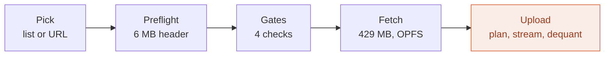
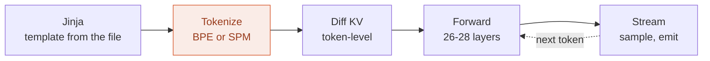
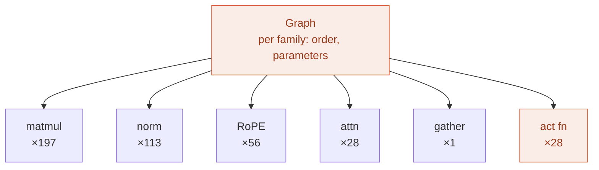

# Logical overview

What the harness does, and where it varies by model family.

This is the **logical** view: phases, responsibilities, and fork points. It
names no files, no types, and no interfaces — mapping this onto the repo is a
separate document, written when the mapping is real. A previous architecture
document drifted because it described a design that was never built; this one
is kept to claims that can be checked against a model file.

Every number here was read from real GGUF headers, not estimated. Provenance is
at the bottom.

## The flow



**Load** runs once per model. Everything before `Fetch` is cheap enough to
reject an incompatible model before its bytes are spent.



**Generate** runs per turn. The whole conversation is re-rendered and
re-tokenized every turn; `Diff KV` is what makes that cheap.



**Inside Forward.** A per-family graph decides order and parameters; the
kernels it dispatches are shared. Counts are Qwen3-0.6B, per token.

Shaded nodes across all three diagrams are the **entire** fork surface.
Everything else is written once and serves every model family.

The dispatch counts are not estimates. The file carries 198 Q4_0 tensors and
113 F32 tensors, and those decompose exactly as 7 projections × 28 layers plus
the embedding and the output head, and 4 norms × 28 layers plus the final norm.
The quantization census *is* the dispatch count — 197 of those tensors are
consumed by the matmul and one, the embedding, by the gather.

## The fork surface

| Fork | Discriminator | Cost for a new family |
|---|---|---|
| **Dequantization** | per-tensor type | one unpack function and one shader branch per type |
| **Tokenizer** | `tokenizer.ggml.model` | a real second implementation — BPE and SPM share nothing |
| **Graph** | `general.architecture` | order and parameters; roughly a hundred lines of dispatch |
| **Activation** | implied by architecture | `silu(x)*y` versus `gelu(x)*y` |

What is **not** a fork, and the reasoning matters more than the list:

- **The matmul.** It varies on quantization type, never on family. It is 197 of
  the ~295 dispatches per token and effectively all of the weight bandwidth, so
  the one kernel worth optimising hard is the one that is written once.
- **Normalisation.** Gemma computes `x/rms(x) · (1 + w)` where Qwen computes
  `x/rms(x) · w`. Storing `w' = 1 + w` at upload makes the kernel identical.
  Transform at load, keep the kernel uniform — the same principle as
  de-interleaving quantized blocks into aligned streams.
- **RoPE and attention.** Different theta, different window bounds. Parameters,
  not code. Gemma's interleaved local/global pattern is a per-layer bound.

## Why the KV cache never forks

The cache is keyed on **the token sequence**, never on the message list.

Each turn, the whole conversation is re-rendered through the model's own chat
template, tokenized, and diffed against the tokens already cached. The cache is
truncated to the longest common prefix — a length counter, no data movement —
and only the suffix is prefilled.

This is not a performance convenience. It is the only correct option, because
**a chat template may rewrite history retroactively.** Qwen3's template computes
`last_query_index` by scanning backwards for the most recent user turn, then:

```jinja

    ... '<think>\n' + reasoning_content + '\n</think>\n\n' + content

    ... content          {# think block dropped #}

```

Adding a user turn moves `last_query_index`, so an assistant message that
rendered *with* its reasoning block last turn renders *without* it this turn.
Any scheme that caches on message boundaries reuses a prefix the template
already rewrote, and the corruption is invisible — the output just gets worse.

Two consequences:

- **The JS side is stateless with respect to the cache.** It renders everything
  and sends a string. It does not compute deltas, track what is cached, or know
  that token identifiers exist. One place can get this wrong, and it is the
  place holding the tokens.
- **Context overflow uses the same mechanism.** Drop the oldest messages,
  re-render, and the diff finds a short common prefix on its own. Slower for
  that turn, correct by construction, and visible to the user.

## The rule the evidence forced

**`general.architecture` selects which code runs. The file supplies every
number.**

Two conversions of Gemma 3 1B disagree: Google's official QAT build declares
`sliding_window = 1024`, a community build of the same model declares `512`.
Same architecture string, same weights, different metadata — and one of them
would be wrong against a config struct with baked-in constants.

So layer count, head counts, head dimension, window size, RoPE theta, epsilon
and context length are read per file. This is also why the cache code is
family-agnostic: every quantity it needs arrives as data.

## Why preflight exists

A model is rejected **before** its bytes are spent. The metadata block and
tensor index of a 429 MB file end at 5.95 MB — 1.4% — and that is enough to
answer every compatibility question, including the one only the tensor index
can answer: which quantization types are actually present.

That last point is not hypothetical. Neither file named `q4_0` for Gemma 3 is
pure Q4_0. Google's QAT build keeps the embedding in F16 at 604 MB — 60% of a
1,004 MB download is not Q4_0 at all — and that single tensor is 4.7× the
default storage-binding limit, so it fails on device fit as well as on type.

The four gates: architecture implemented, every tensor type implemented,
tokenizer implemented, and the residency plan fits the **granted** device
limits. The planner is a pure function of tensor index and limits, which is
what lets it run before a single weight byte is fetched.

The gates and the dequantization dispatch must consult **one** capability
table. Two lists will diverge, and a picker that reports "compatible" for a
model that then fails to load is worse than no picker.

## Facts this rests on

Read from GGUF headers by range request on 2026-09-23.

| | Qwen3-0.6B Q4_0 | Gemma 3 1B Q4_0 |
|---|---|---|
| Source | `ggml-org/Qwen3-0.6B-GGUF` | `google/…-qat-q4_0-gguf` / `unsloth/…` |
| File size | 429.0 MB | 1,004 MB / — |
| Tensors | 311 | 340 |
| Types present | Q4_0 198, F32 113 | F32 157, F16 1, Q4_0 182 / F32 157, Q8_0 1, Q4_0 179, Q4_1 3 |
| Header ends at | 5.95 MB | 6.53 MB |
| `tokenizer.ggml.model` | `gpt2` | `llama` |
| Vocabulary | 151,936 tokens, 151,387 merges | 262,144 tokens |
| Layers | 28 | 26 |
| KV heads × head dim | 8 × 128 | **1 × 256** |
| Attention | all global | 5:1 local/global, window 1024 / 512 |
| **KV per token, f16** | **112 KiB** | **26 KiB** |
| **Full-context KV** | 40,960 ctx → **4.4 GiB** | 32,768 ctx → **~190 MB** |

Two findings worth carrying forward:

- **Qwen3 stores its tied embedding twice.** `token_embd.weight` and
  `output.weight` are both Q4_0, both 87.5 MB, and byte-identical at the
  sampled offset. That is 20% of the download, and 87.5 MB of device memory
  that a planner detecting duplicates does not have to spend.
- **Gemma 3 1B holds its entire advertised context in a browser; Qwen3-0.6B
  cannot hold a tenth of its own.** Roughly 23× apart, from one KV head against
  eight and a sliding window against none. Which model is the better browser
  target is an open question, not settled here.

## What this document does not contain

No file layout, no type names, no interfaces, no acceptance criteria. Those
belong to the mapping that comes next, and writing them here before the code
exists is how the previous architecture document became fiction.
